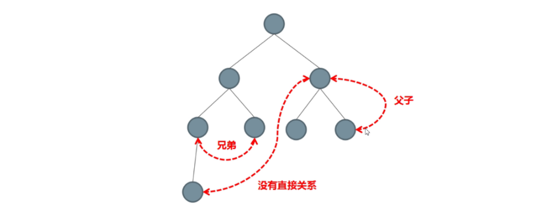
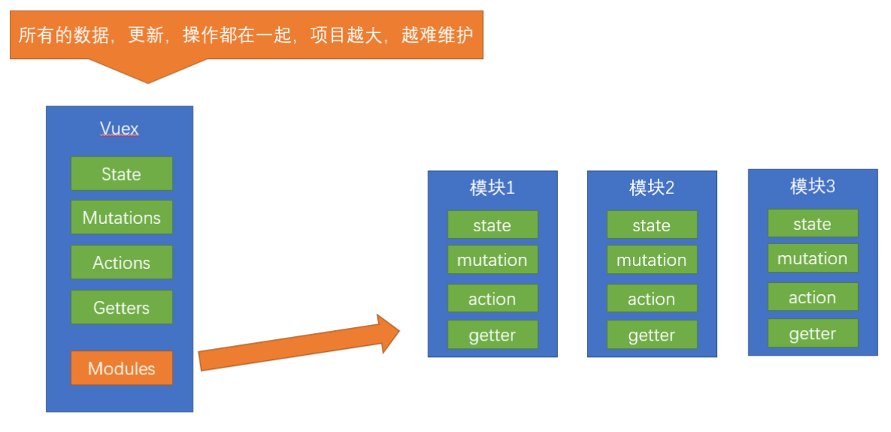
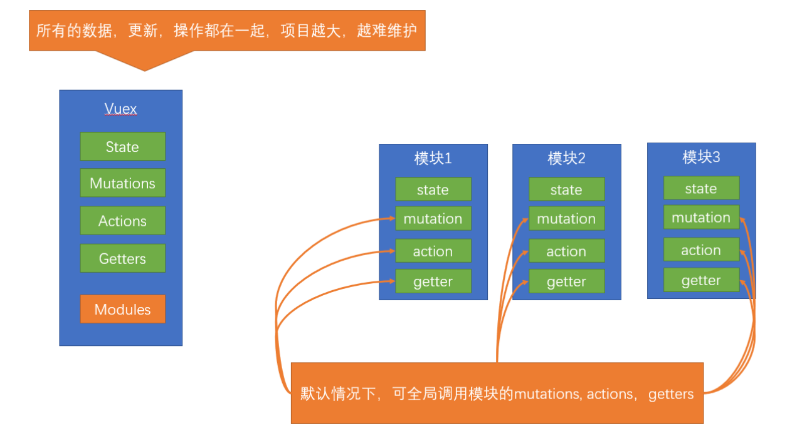
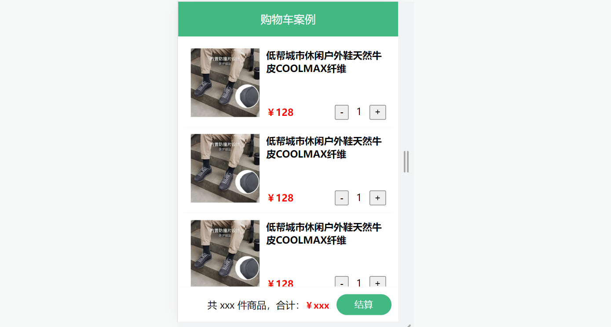

# vuex 概述 

目标：

- 了解vuex的应用场景  (在哪用)
- 掌握vuex的基本使用  (怎么用)

**vuex 是一个 vue 的状态管理工具,  状态就是数据**


vuex是一个插件工具，可以帮我们vue管理通用的数据

之前如果要进行跨组件的数据通信  =>  父传子，子传父  =>  一旦组件关系复杂，数据非常难以维护


## 回顾-组件之间共享状态 (组件通信方案)

默认组件的数据, 是独立的, 每个组件有着自己的状态(数据)

>  状态 === 数据



组件之间共享状态的两种典型方式：

- 父子之间 : props + $emit

  父传子：props属性绑定

  ```
  <son1 msg="msg"></son1>
  ```

  子传父：$emit事件绑定

  ```
  <div>
  	<button @click="$emit('event-name')">通知父组件</button>
  </div>
  ```

如果某个状态需要在很多个组件来使用，或者要实现多个组件共同维护一份数据又应该怎么做呢 ？

这里就要引入Vuex了。


## vuex基本概念

[中文文档](https://vuex.vuejs.org/zh/guide/)

vuex是vue的状态管理工具，**状态即数据**。 状态管理就是集中管理vue中 **通用的** 一些数据

注意（官方原文）：

- 不是所有的场景都适用于vuex，只有在必要的时候才使用vuex
- 使用了vuex之后，会附加更多的框架中的概念进来，增加了项目的复杂度  （数据的操作更便捷，数据的流动更清晰）

Vuex就像《近视眼镜》, 你自然会知道什么时候需要用它~


## vuex的优点: 方便的解决多组件的共享状态

 vuex的作用是解决《多组件状态共享》的问题。

- 它是独立于组件而单独存在的，所有的组件都可以把它当作  **一座桥梁** 来进行通讯。

- 特点：

  - **响应式**： 只要仓库一变化，其他所有地方都更新 （太爽了！！！）
  - 操作更简洁

  代码量非常少, 但是需要熟悉


## 什么数据适合存到vuex中

一般情况下，只有  **多个组件均需要共享的数据** ，才有必要存储在vuex中，

对于某个组件中的私有数据，依旧存储在组件自身的data中。

例如：

- 对于所有组件而言，当前登陆的   **用户信息**  是需要在全体组件之间共享的，则它可以放在vuex中
- 对于文章详情页组件来说，当前的用户浏览的文章列表数据则应该属于这个组件的私有数据，应该要放在这个组件data中。


## 概述小结:

1. vuex解决什么问题?   vuex 能解决  **多组件共享数据**  的问题,  非常方便便捷
2. 什么样的数据, 适合存放到vuex?   多组件的  **通用**  的共用数据, 适合存到 vuex

vuex 两大优势:

1. 响应式变化
2. 操作简洁  (vuex提供了一些简化语法的辅助函数, 这些辅助函数, 需要熟练掌握)


# vuex入门

## 需求: 多组件共享数据

对于如下三个组件（一个父组件，两个子组件）


效果是三个组件共享一份数据:

- 任意一个组件都可以修改数据
- 三个组件的数据是同步的

1 创建项目

```
vue create vuex-demo
```

2 创建三个组件, 目录如下

```
|-components
|--add-item.vue
|--sub-item.vue
|-App.vue
```

3 源代码如下

`App.vue`在入口组件中引入add-item和sub-item这两个子组件

```html
<template>
  <div id="app">
    <h1>根组件</h1>
    <input type="text">
    <add-item></add-item>
    <hr>
    <sub-item></sub-item>
  </div>
</template>

<script>
import AddItem from './components/add-item.vue'
import SubItem from './components/sub-item.vue'

export default {
  name: 'app',
  data: function () {
    return {
      
    }
  },
  components: {
    AddItem,
    SubItem
  }
}
</script>

<style>
#app {
  width: 600px;
  margin: 20px auto;
  border: 3px solid #ccc;
  border-radius: 3px;
  padding: 10px;
}
</style>
```

`main.js`

```js
import Vue from 'vue'
import App from './App.vue'

Vue.config.productionTip = false

new Vue({
  render: h => h(App)
}).$mount('#app')
```

`sub-item.vue`

```html
<template>
  <div class="box">
    <h2>子组件 sub</h2>
    从vuex中获取的值: <label></label>
    <br>
    <button>值-1</button>
  </div>
</template>

<script>
export default {
  name: 'SubItem'
}
</script>

<style lang="css" scoped>
.box{
  border: 3px solid #ccc;
  width: 400px;
  padding: 10px;
  margin: 20px;
}
h2 {
  margin-top: 10px;
}
</style>

```

`add-item.vue`

```html
<template>
  <div class="box">
    <h2>子组件 add</h2>
    从vuex中获取的值:<label></label>
    <br />
    <button>值+1</button>
  </div>
</template>

<script>
export default {
  name: 'AddItem'
}
</script>

<style lang="css" scoped>
.box {
  border: 3px solid #ccc;
  width: 400px;
  padding: 10px;
  margin: 20px;
}
h2 {
  margin-top: 10px;
}
</style>
```


## vuex 的使用 - 创建仓库

1 安装 vuex, 与vue-router类似，vuex是一个独立存在的插件，如果脚手架初始化没有选 vuex，就需要额外安装。

```
yarn add vuex@3.4.0
```

2 新建 `store/index.js` 专门存放 vuex

​	为了维护项目目录的整洁，在src目录下新建一个store目录其下放置一个index.js文件。 (和 `router/index.js` 类似)

​	

3 创建仓库 `store/index.js` 

```jsx
// 导入 vue
import Vue from 'vue'
// 导入 vuex
import Vuex from 'vuex'
// vuex也是vue的插件, 需要use一下, 进行插件的安装初始化
Vue.use(Vuex)

// 创建仓库 store
const store = new Vuex.Store()

// 导出仓库
export default store
```

4 在 main.js 中导入挂载到 Vue 实例上

```js
import Vue from 'vue'
import App from './App.vue'
import store from './store'

Vue.config.productionTip = false

new Vue({
  render: h => h(App),
  store
}).$mount('#app')
```

此刻起, 就成功创建了一个 **空仓库!!**


## 核心概念 - state 状态

State提供唯一的公共数据源，所有共享的数据都要统一放到Store中的State中存储。

打开项目中的store.js文件，在state对象中可以添加我们要共享的数据。

```jsx
// 创建仓库 store
const store = new Vuex.Store({
  // state 状态, 即数据, 类似于vue组件中的data,
  // 区别在于 data 是组件自己的数据, 而 state 中的数据整个vue项目的组件都能访问到
  state: {
    count: 101
  }
})
```

问题: 如何在组件中获取count?

1. 插值表达式 =》  {{  $store.state.count  }}
2. mapState 映射计算属性 =》  {{ count  }}


**1 原始形式- 插值表达式**

**`App.vue`**

组件中可以使用  **this.$store** 获取到vuex中的store对象实例，可通过**state**属性属性获取**count**， 如下

```vue
<h1>state的数据 - {{ $store.state.count }}</h1>
```

**计算属性** - 将state属性定义在计算属性中 https://vuex.vuejs.org/zh/guide/state.html

```js
// 把state中数据，定义在组件内的计算属性中
  computed: {
    count () {
      return this.$store.state.count
    }
  }
```

```vue
<h1>state的数据 - {{ count }}</h1>
```

但是每次, 都这样一个个的提供计算属性, 太麻烦了, 所以我们需要辅助函数 mapState 帮我们简化语法


**2 辅助函数  - mapState**

>mapState是辅助函数，帮助我们把store中的数据映射到 组件的计算属性中, 它属于一种方便的用法

用法 ： 

第一步：导入mapState (mapState是vuex中的一个函数)

```js
import { mapState } from 'vuex'
```

第二步：采用数组形式引入state属性

```js
mapState(['count']) 
```

> 上面代码的最终得到的是 **类似于**

```js
count () {
    return this.$store.state.count
}
```

第三步：利用**展开运算符**将导出的状态映射给计算属性

```js
  computed: {
    ...mapState(['count'])
  }
```

```vue
 <div> state的数据：{{ count }}</div>
```


## 核心概念 - mutations

### 基本使用

通过 `strict: true` 可以开启严格模式

> **state数据的修改只能通过mutations，并且mutations必须是同步的**

**定义mutations**

```js
const store  = new Vuex.Store({
  state: {
    count: 0
  },
  // 定义mutations
  mutations: {
     
  }
})
```

**格式说明**

mutations是一个对象，对象中存放修改state的方法

```js
mutations: {
    // 方法里参数 第一个参数是当前store的state属性
    // payload 载荷 运输参数 调用mutaiions的时候 可以传递参数 传递载荷
    addCount (state) {
      state.count += 1
    }
  },
```

组件中提交 mutations

```jsx
this.$store.commit('addCount')
```

**解决问题: 两个子组件, 添加操作 add,  addN 实现**


### 带参数的 mutation

需求: 父组件也希望能改到数据

提交 mutation 是可以传递参数的  `this.$store.commit('xxx',  参数)`

1 提供mutation函数

```js
mutations: {
  ...
  inputCount (state, count) {
    state.count = count
  }
},
```

2 注册事件

```jsx
<input type="text" :value="count" @input="handleInput">
```

3 提交mutation

```jsx
handleInput (e) {
  this.$store.commit('inputCount', +e.target.value)
}
```

**小tips: 提交的参数只能是一个, 如果有多个参数要传, 可以传递一个对象**

```jsx
this.$store.commit('inputCount', {
  count: e.target.value
})
```

**解决问题:  addN 的实现**


### **辅助函数** - mapMutations

> mapMutations和mapState很像，它把位于mutations中的方法提取了出来，我们可以将它导入

```js
import  { mapMutations } from 'vuex'
methods: {
    ...mapMutations(['addCount'])
}
```

> 上面代码的含义是将mutations的方法导入了methods中，等价于

```js
methods: {
      // commit(方法名, 载荷参数)
      addCount () {
          this.$store.commit('addCount')
      }
 }
```

此时，就可以直接通过this.addCount调用了

```jsx
<button @click="addCount">值+1</button>
```

但是请注意： Vuex中mutations中要求不能写异步代码，如果有异步的ajax请求，应该放置在actions中


## 核心概念-actions

> state是存放数据的，mutations是同步更新数据 (便于监测数据的变化, 更新视图等, 方便于调试工具查看变化)，
>
> actions则负责进行异步操作

**需求: 一秒钟之后, 要给一个数 去修改state**


**定义actions**

```js
actions: {
  setAsyncCount (context, num) {
    // 一秒后, 给一个数, 去修改 num
    setTimeout(() => {
      context.commit('inputCount', num)
    }, 1000)
  }
},
```

**原始调用** - $store (支持传参)

```js
setAsyncCount () {
  this.$store.dispatch('setAsyncCount', 200)
}
```


**辅助函数** -mapActions

> actions也有辅助函数，可以将action导入到组件中

```js
import { mapActions } from 'vuex'
methods: {
    ...mapActions(['setAsyncCount'])
}
```

直接通过 this.方法 就可以调用

```vue
<button @click="setAsyncCount(200)">+异步</button>
```


## 核心概念-getters

> 除了state之外，有时我们还需要从state中派生出一些状态，这些状态是依赖state的，此时会用到getters

例如，state中定义了list，为1-10的数组，

```js
state: {
    list: [1, 2, 3, 4, 5, 6, 7, 8, 9, 10]
}
```

组件中，需要显示所有大于5的数据，正常的方式，是需要list在组件中进行再一步的处理，但是getters可以帮助我们实现它

**定义getters**

```js
  getters: {
    // getters函数的第一个参数是 state
    // 必须要有返回值
     filterList:  state =>  state.list.filter(item => item > 5)
  }
```

使用getters

**原始方式** -$store

```vue
<div>{{ $store.getters.filterList }}</div>
```

**辅助函数** - mapGetters

```js
computed: {
    ...mapGetters(['filterList'])
}
```

```vue
 <div>{{ filterList }}</div>
```


## 核心概念 - 模块 module (**进阶拓展**)

> **由于使用单一状态树，应用的所有状态会集中到一个比较大的对象。当应用变得非常复杂时，store 对象就有可能变得相当臃肿。**

这句话的意思是，如果把所有的状态都放在state中，当项目变得越来越大的时候，Vuex会变得越来越难以维护

由此，又有了Vuex的模块化




### **模块定义** - 准备 state

定义两个模块   **user** 和  **setting**

user中管理用户的信息状态  userInfo  `modules/user.js`

```jsx
const state = {
  userInfo: {
    name: 'zs',
    age: 18
  }
}

const mutations = {}

const actions = {}

const getters = {}

export default {
  state,
  mutations,
  actions,
  getters
}

```

setting中管理项目应用的名称 title, desc  `modules/setting.js`

```jsx
const state = {
  title: '这是大标题',
  desc: '描述真呀真不错'
}

const mutations = {}

const actions = {}

const getters = {}

export default {
  state,
  mutations,
  actions,
  getters
}
```

使用模块中的数据,  可以直接通过模块名访问 `$store.state.模块名.xxx`  =>  `$store.state.setting.title`

也可以通过 mapState 映射


### 命名空间 namespaced

默认情况下，模块内部的 action、mutation 和 getter 是注册在**全局命名空间**的

这句话的意思是 刚才的 user模块 还是 setting模块，它的 action、mutation 和 getter 其实并没有区分，都可以直接通过全局的方式调用, 如下图所示:



但是，如果我们想保证内部模块的高封闭性，我们可以采用namespaced来进行设置

`modules/user.js`

```jsx
const state = {
  userInfo: {
    name: 'zs',
    age: 18
  },
  myMsg: '我的数据'
}

const mutations = {
  updateMsg (state, msg) {
    state.myMsg = msg
  }
}

const actions = {}

const getters = {}

export default {
  namespaced: true,
  state,
  mutations,
  actions,
  getters
}
```

提交模块中的mutation

```jsx
全局的:   this.$store.commit('mutation函数名', 参数)

模块中的: this.$store.commit('模块名/mutation函数名', 参数)
```

namespaced: true 后, 要添加映射, 可以加上模块名, 找对应模块的 state/mutations/actions/getters

```jsx
computed: {
  // 全局的
  ...mapState(['count']),
  // 模块中的
  ...mapState('user', ['myMsg']),
},
methods: {
  // 全局的
  ...mapMutations(['addCount'])
  // 模块中的
  ...mapMutations('user', ['updateMsg'])
}
```


# 综合案例 - 购物车

## 创建项目

1. 脚手架新建项目 (注意：**勾选vuex**)      

   版本说明：vue2   vue-router3   vuex3               vue3  vue-router4  vuex4/pinia

```
vue create vue-cart-demo
```

2. 将原本src内容清空，替换成教学资料的《vuex-cart-准备代码》



需求：

1. 发请求动态渲染购物车，数据存vuex （存cart模块， 将来还会有user模块，article模块...）
2. 可以修改数据
3. 动态计算总价和总数量


## 构建vuex-cart模块

1. 新建 `store/modules/cart.js`

```jsx
export default {
  namespaced: true,
  state () {
    return {
      list: []
    }
  },
}
```

2. 挂载到 vuex 仓库上 `store/cart.js`

```jsx
import Vuex from 'vuex'
import Vue from 'vue'

import cart from './modules/cart'

Vue.use(Vuex)

const store = new Vuex.Store({
  modules: {
    cart
  }
})

export default store
```


## 准备后端接口服务环境(了解)

1. 安装全局工具 json-server （全局工具仅需要安装一次）

```
yarn global add json-server 或 npm  i  json-server  -g
```

2. 代码根目录新建一个 db 目录
3. 将资料 index.json 移入 db 目录
4. 进入 db 目录，执行命令，启动后端接口服务

```
json-server index.json
```


## 请求动态渲染数据

1. 安装 axios

```jsx
yarn add axios
```

2. 准备actions 和 mutations

```jsx
import axios from 'axios'

export default {
  namespaced: true,
  state () {
    return {
      list: []
    }
  },
  mutations: {
    updateList (state, payload) {
      state.list = payload
    }
  },
  actions: {
    async getList (ctx) {
      const res = await axios.get('http://localhost:3000/cart')
      ctx.commit('updateList', res.data)
    }
  }
}
```

3. `App.vue`页面中调用 action,  获取数据

```jsx
import { mapState } from 'vuex'

export default {
  name: 'App',
  components: {
    CartHeader,
    CartFooter,
    CartItem
  },
  created () {
    this.$store.dispatch('cart/getList')
  },
  computed: {
    ...mapState('cart', ['list'])
  }
}
```

4. 动态渲染

```jsx
<!-- 商品 Item 项组件 -->
<cart-item v-for="item in list" :key="item.id" :item="item"></cart-item>
```

`cart-item.vue`

```jsx
<template>
  <div class="goods-container">
    <!-- 左侧图片区域 -->
    <div class="left">
      
    </div>
    <!-- 右侧商品区域 -->
    <div class="right">
      <!-- 标题 -->
      <div class="title">{{item.name}}</div>
      <div class="info">
        <!-- 单价 -->
        <span class="price">￥{{item.price}}</span>
        <div class="btns">
          <!-- 按钮区域 -->
          <button class="btn btn-light">-</button>
          <span class="count">{{item.count}}</span>
          <button class="btn btn-light">+</button>
        </div>
      </div>
    </div>
  </div>
</template>

<script>
export default {
  name: 'CartItem',
  props: {
    item: Object
  },
  methods: {

  }
}
</script>
```


## 修改数量

1. 注册点击事件

```jsx
<!-- 按钮区域 -->
<button class="btn btn-light" @click="onBtnClick(-1)">-</button>
<span class="count">{{item.count}}</span>
<button class="btn btn-light" @click="onBtnClick(1)">+</button>
```

2. 页面中dispatch action

```jsx
onBtnClick (step) {
  const newCount = this.item.count + step
  if (newCount < 1) return

  // 发送修改数量请求
  this.$store.dispatch('cart/updateCount', {
    id: this.item.id,
    count: newCount
  })
}
```

3. 提供action函数

```jsx
async updateCount (ctx, payload) {
  await axios.patch('http://localhost:3000/cart/' + payload.id, {
    count: payload.count
  })
  ctx.commit('updateCount', payload)
}
```

4. 提供mutation处理函数

```jsx
mutations: {
  ...,
  updateCount (state, payload) {
    const goods = state.list.find((item) => item.id === payload.id)
    goods.count = payload.count
  }
},
```


## 底部总价展示

1. 提供getters

```jsx
getters: {
  total(state) {
    return state.list.reduce((p, c) => p + c.count, 0);
  },
  totalPrice (state) {
    return state.list.reduce((p, c) => p + c.count * c.price, 0);
  },
},
```

2. 动态渲染

```jsx
<template>
  <div class="footer-container">
    <!-- 中间的合计 -->
    <div>
      <span>共 {{total}} 件商品，合计：</span>
      <span class="price">￥{{totalPrice}}</span>
    </div>
    <!-- 右侧结算按钮 -->
    <button class="btn btn-success btn-settle">结算</button>
  </div>
</template>

<script>
import { mapGetters } from 'vuex'
export default {
  name: 'CartFooter',
  computed: {
    ...mapGetters('cart', ['total', 'totalPrice'])
  }
}
</script>
```


